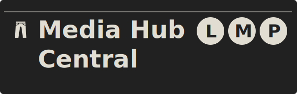
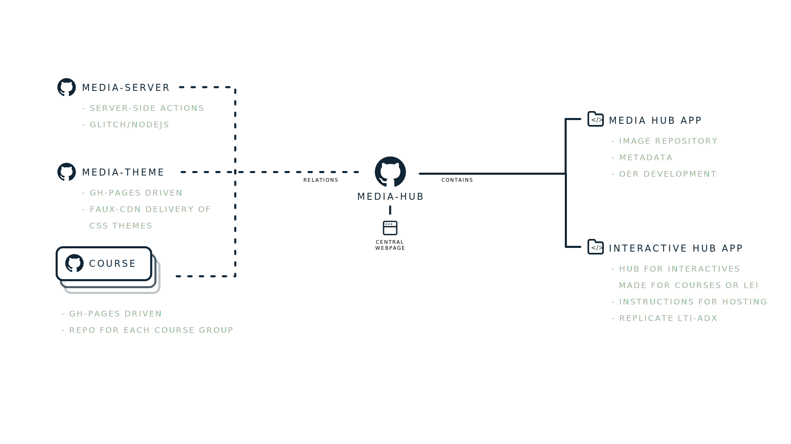

 

# Media-Hub
Central repository of LMP's Media Hub project. Central contains the base web app for exploring LMP resources and Open Educational Resources (OERs) as well as having close relationships with other repositories which fall under the Media Hub project. These include:

- Media Hub Repository 
- LMP Style Guide and Design Language development
- Learning Resource Plugins and Interactives
- Web App Helpers

## Project Diagram

WIP Project diagram is shown below with `Media-Hub` sitting in the middle between external repositories interacting with the central service and direct children of the Media Hub project.

 

